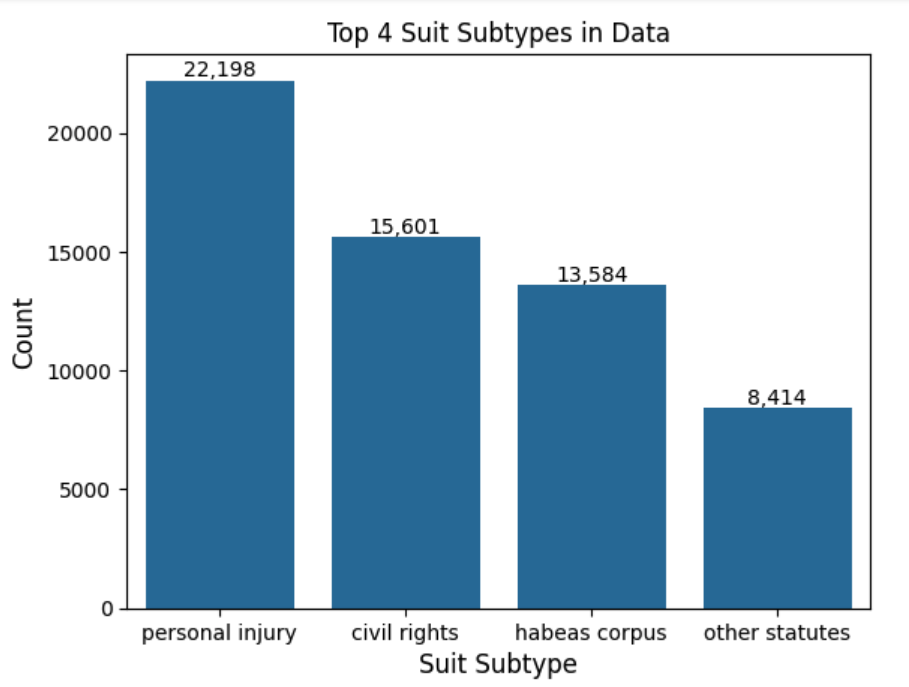
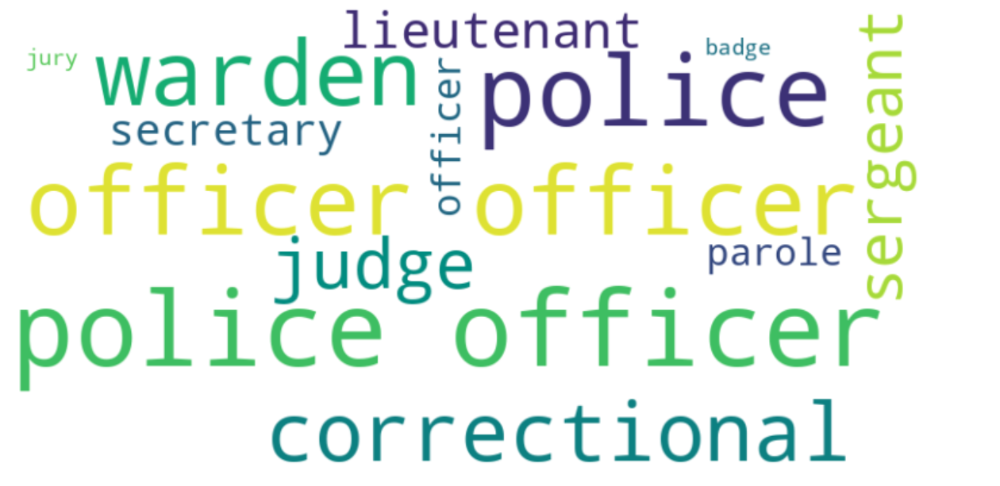
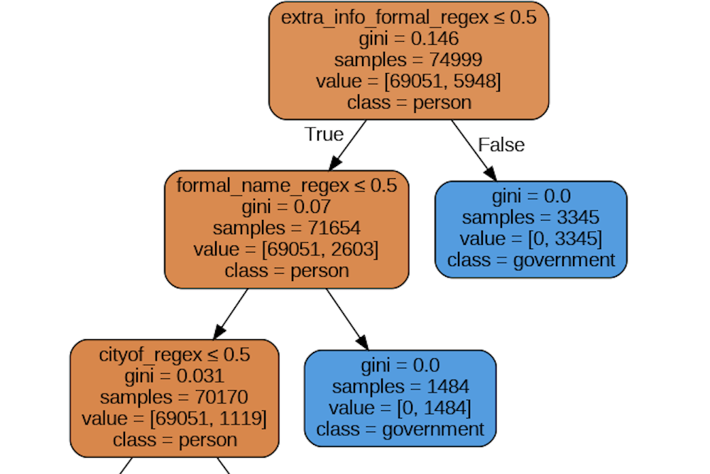
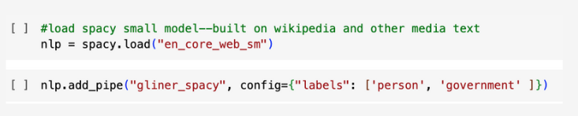

#  Rule Based NER (Named Entity Recognition) and Model-Based NER to Identify Government Entities in Court Documents 

## Project Overview
This project is part of the Spring 2024 Knowledge Centric AI hackathon hosted by [KnowHax](https://www.knowhax.com/).  The business problem being solved is identifying whether a government entity or person was involved in a court case soley utilizing a four column dataset with one column being that of'name' which was the primary column used to create the target labels of 'government' and 'person'.  This custom made target was created in two ways:  one being rules-based utilizing pattern recognition and the other being using a zero-shot large language model called GLiNER-medium-v2.1 found on [HuggingFace](https://huggingface.co/spaces/tomaarsen/gliner_medium-v2.1).  

## Business Problem
The United States Criminal Justice System spends a total of approximately $264B per year.  Limited national data exists about court systems more importantly who is being prosecuted and convicted and the outcomes of those convictions.  [SCALES](https://docs.scales-okn.org/nlp/) seeks to connect data systems within the criminal justics system to evaluate the efficiency of the court systems and subsequent outcomes for research purposes. This project in particular wanted to focus on identifying when governments are involved in suits (for example policing and prison entities) versus persons to help support research efforts about government entity conditions and ciminal justice system resources.   

## Data Overview 
The following was done by the project sponsor-SCALES
- Webscraped dockets from [PACER](https://pacer.uscourts.gov/) (Public Access to Court Electronic Records)
- Extracted named entities from each docket using a custom scraper
- These dockets covered several case lists that can be found [Here](https://docs.scales-okn.org/rdf/) covered national cases from 2002-2020.
- JSON and Turtle files can be downloaded [Here](http://scalesokndata.ci.northwestern.edu/#/home) (need to sign up for a FREE account)
- A CSV file was created with approximately 3.5 million rows from the above files
- Due to computational resources and time constraints the hacakathon team random sampled 100k rows from the CSV file which is found in the 'data' folder of this repo
- The following columns are in the above CSV file
     - **Name**:  A party name that appears in one or more cases
     - **Extra Info**:  Extra Info about the party that may/may not can be used (roughly 50% missing)
     - **Nature-of-suit Subtype**:  Type of case in which the party belongs to (i.e. immigration, criminal, habeaus corpus, etc.)
     - **UIDS**:  Case IDs for the underlying case files
  
  As mentioned above the **name** and **extra_info** columns were predominately used for this NER classifier

## Exploratory Data Analaysis (EDA) 
1. Entire Data File (100k observations) Top 4 Suit Subtypes that comprised 60% of all the data:

2. Word Cloud of the "formal titles" that existed in the data and thus would be classified as government:

## Rule Based Methodology 
1. Create Rules that matches patterns within the name and/or extra_info columns to classify 'government' versus 'person'
2. Some examples of rules are as follows:
   - Column(s) contain a 'formal government title' (i.e. Police, District Attornet, Lieutenant, etc.)
   - Column(s) contain 'city of' or 'department of' (rationale these are mostly state counties involved in the suit which is government)
   - Column(s) DO NOT contain 'llc' (these are mostly 'persons')
3. Build a target based on the rules (binary target of label 'government' or 'person')
4. From that target create a predictive rule-based model, Decision Tree, that uses binary features to predict that target
5. Limitations:  The target was created based on finite rules that may not encompass ALL PATTERNS

## Model Performance on Rule Based Methodolgy
The rule based target we created captured a large amount of person entities and based on our hard formal rules we are confident it identified clear government entities from the **name** and **extra_info** columns. However, it had a significant number of rows that did not match any entity, showcasing the limitation of this method. Further rules would need to be investigated and added in, in order to capture more of the missed values. We were not able to capture all patterns due to time contraints.  

The decision tree model had an accuracy of 99% and Recall of 91% on unseen data.  False Negatives occured roughly 0.6% of the time -- the model stated it was a person (0) when in fact it was a government entity (1)

The top features included:  If the 'name' or 'extra_info' columns contained a formal government title and the 'name' field containing "city of":

## Zero Shot GLiNER LLM Model Methodology and Code: 
1.  Import a foundational spacy NER model that can recognize 18 entities.  Model Documentation[Here](https://spacy.io/models/en#en_core_web_sm)
2.  Add custom labels to identify: 'government' and 'person'
3.  Add the zero shot labels to a sample of 2k observations (due to comptational resources needed a smaller data set)

Code: 

Results:  Matched the rule-based target created at 59%

Limitations:  Can generate more than one label for each observation, not good at picking up "formal titles" in front of names and assigning it as "government" 

## Tuned spaCy LLM Model using custom training data 
1.  Use Faker to generate fake English, Spanish, and English Indian names
2.  Create a text file of 'formal titles' (found in data folder) and of person suffixes (l.l.c, .inc, etc.)
3.  Append these files together to generate names with formal titles labeled 'government' and names with person suffixes labeled 'person'
4.  Add this custom data to the LLM pipe

Results: Variable with the worse assigning 'government' to all observations.  This still needs to be investigated but we have good 'starter code' in the notebook/  

## Learnings and Recommendations 
- Creating finite rules to determine a target then running a Machine Learning model against that target performs pretty well 

- The limitations are the difficulty in being able to define almost all the rules needed to create a robust target and having computational resources to train a foundational model with custom training data  

- Even though the zero-shot LLM model was ~59% accurate, it can still be used to identify names that were matched to both labels for further investigation and to help create more rules 

- Custom training data could potentially be used to train the model but computational (cloud) resources would be needed since it has difficulty performing on just a local machine 

## Future Steps 
1.  Create a cloud environment that can train the custom spaCy model
2.  Determine more rules that can separate 'government' from 'person' entities 

## Contact
- Angelica "Jelly" Spratley, MSc (Project and Technical lead):  [LinkedIn](https://www.linkedin.com/in/angelicaspratley/)
- Daniel Burdeno, MSc (Code Quality lead and Technical Assistant):  [LinkedIn](https://www.linkedin.com/in/daniel-burdeno/)
- Dr. Uohna Thiessen (Strategy and Creative lead):  [LinkedIn](https://www.linkedin.com/in/druohna-datascientist/) 
